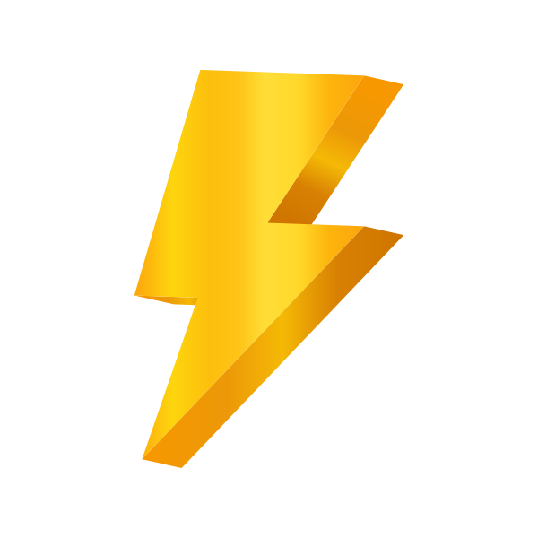

# Lightbolt - Easy IT learning

 

 

Our developers' first hackathon project

Our team has created a website that helps students to improve IT skills.
1) It allows you to get a set of the most common terms on a specific topic from the server.
2) You can check the meaning of each term.
3) You have the option to add new terms to the collection and remove ones that you have already learned.
4) The website also randomly displays the words on the screen.
  

# Technologies

  &nbsp;
  &nbsp;
  &nbsp;
  &nbsp;
  &nbsp;
  &nbsp;

  

# Development team
<h3>
  &nbsp;
  &nbsp;
  &nbsp;
  &nbsp;
  
</h3>

  

# You may check the website following the link
 ...in progress...
  

# Some of the parts are still to be worked on
- changing titles
- responsive design
- accounts
